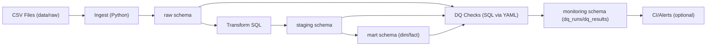

# ReliabilityOps — DataTrust Platform
**Production-grade ETL + Data Quality Gates + Monitoring (raw → staging → mart)**

A production-style mini data platform for Data Technician / Data Ops portfolios: **raw → staging → mart** with **data quality gates** + **monitoring**.

---

## What you get
- **Ingestion**: loads CSVs into `raw.*` tables (with metadata columns)
- **Transforms**: cleans + normalizes into `staging.*`, then builds a **star schema** in `mart.*`
- **DQ Gates**: YAML-driven SQL checks (null/unique/FK/range constraints)
- **Monitoring**: every run writes to `monitoring.dq_runs` + `monitoring.dq_results`
- **Sample messy data generator**: duplicates, missing values, bad foreign keys, negative amounts (for realistic failures)

---

## Architecture


---

## Quickstart (Postgres via Docker)
### 1) Start Postgres
```bash
docker compose up -d
```

### 2) Create a venv + install deps
```bash
python -m venv .venv
# Windows: .venv\Scripts\activate
source .venv/bin/activate
pip install -r requirements.txt
```

### 3) Configure env
```bash
cp .env.example .env
```

### 4) Generate sample data + run the full pipeline
```bash
python scripts/generate_sample_data.py
python run_pipeline.py run
```

---

## Repo structure
```text
src/                core pipeline code
sql/                schemas + transforms
dq/                 YAML-driven DQ checks
scripts/            sample data generator
reports/            DQ reports (generated)
docker-compose.yml  local Postgres
```

---

## Customize for your own dataset
1. Replace `data/raw/*.csv` with your dataset (keep or update expected columns in `src/ingest.py`)
2. Update transforms in `sql/10_transform.sql` and marts in `sql/20_mart.sql`
3. Add/modify checks in `dq/checks.yml` (each check returns numeric `observed`)

---

## Links
- GitHub: `https://github.com/prakhardewangan2005-hash/reliabilityops-datatrust-platform`
- ## Results (sample run)
**Checks:** 21 | **Passed:** 20 | **Failed:** 1 | **High severity failed:** 1

Artifacts generated:
- `reports/dq_report_*.json`
- `monitoring.dq_runs` + `monitoring.dq_results` tables populated


This project demonstrates **data ingestion, SQL modeling, data quality enforcement, and run-level monitoring** — the core loop of Data Ops / Data Technician roles.

## Screenshots


